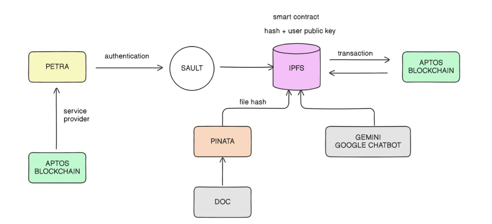

# 🔐 SAULT - Blockchain-Powered Document Management

Welcome to Sault, your trusted document management solution that leverages blockchain technology for secure, transparent, and efficient document handling.


[Live Demo Video](https://youtu.be/LxioW6BvH2o)

---

## 🔍 Problem → Cause → Solution Journey

### 🔴 Problem

- Organizations face **difficulty managing important documents**.
- Traditional methods are often **scattered, unsecure**, and **lack categorization**.
- It becomes **time-consuming** to locate, verify, and organize files.
- There's a **risk of data loss, fraud**, or unauthorized access.
- Lack of Trust in Bussiness contract

### 🔠 Causes

- Paper or traditional digital systems are **decentralized and disorganized**.
- **Lack of encryption** and verification mechanisms.
- **No single secure repository** for all types of documents.
- Difficulty in **detecting duplicate or tampered files**.

### 🟢 Solution – SAULT

- **Secure Vault**: All your documents are safely stored with blockchain immutability.
- **Robust Contract**: There is share in which two or more parties can sign a contract and verify while making a legal deals, decision etc. 
- **AI-powered Categorization**: Easily organize and retrieve files with intelligent tagging.
- **Fraud Detection**: Detect duplicates, tampered files, and fraudulent documents.
- **Legal and Transparent**: Every transaction and update is securely logged.
- **Chatbot Interface**: Easily query and interact with documents.
- **Blockchain + AI Combo**: Offers security, auditability, and convenience in one place.

---

## 🌟 Features

- 📁 **Secure Document Storage**: Store your documents with blockchain-backed security
- ✍️ **Document Signing**: Digital signature capabilities for legal documents
- 🏼 **Smart Categorization**: Organize documents with intelligent categorization
- 📊 **Analytics Dashboard**: Track and analyze document metrics
- 🔒 **Wallet Integration**: Seamless connection with Aptos blockchain wallets
- ⚡ **Fast Retrieval**: Quick access to your stored documents
- 📱 **Responsive Design**: Works perfectly on both desktop and mobile devices

---

## 🛠️ Technology Stack

- **Frontend**  : React 18 with TypeScript
- **Build Tool**: Vite
- **Styling**   : Tailwind CSS
- **Components**: Radix UI
- **Blockchain**: Aptos Network
- **Wallet**    : Petra
- **Charts**    : Chart.js & Recharts
- **Routing**   : React Router DOM
- **State Management**: React Context

---

## 🚀 Getting Started

### Prerequisites

- Node.js (v16 or higher)
- npm or yarn
- An Aptos-compatible wallet (like Petra or Martian)

### Installation

```bash
git clone https://github.com/ashwinkothavade/HackByte3.0
cd sault
npm install
cp .env.example .env
# Fill in required variables
npm run dev
```

Visit `http://localhost:5173` to start using the app.

---

## 📦 Project Structure

```
sault/
🔽️── blockchain_0/        # Aptos smart contract code
🔽️── frontend/
    🔽️── components/      # React components
    🔽️── utils/           # Utility functions
    🔽️── lib/             # Shared libraries
🔽️── public/              # Static assets
🔽️── scripts/             # Build and deployment scripts
```
---

## 💻 Available Scripts

- `npm run dev`: Start development server
- `npm run build`: Build for production
- `npm run preview`: Preview production build
- `npm run deploy`: Deploy to Vercel
- `npm run lint`: Run ESLint
- `npm run fmt`: Format code with Prettier
- `npm run move:init`: Initialize Move framework
- `npm run move:test`: Run Move tests
- `npm run move:compile`: Compile Move modules
- `npm run move:publish`: Publish Move modules

---

## 📊 Workflow



---

## 👥 Contributors


---

## 🤝 Contributing

1. Fork the repository
2. Create your feature branch (`git checkout -b feature/amazing-feature`)
3. Commit your changes (`git commit -m 'Add some amazing feature'`)
4. Push to the branch (`git push origin feature/amazing-feature`)
5. Open a Pull Request

---

## 📄 License

This project is licensed under the Apache-2.0 License - see the [LICENSE](LICENSE) file for details.

---

## 🔗 Links

- [Documentation](#)
- [Aptos Framework](https://aptos.dev/)
- [Live Demo Video](https://youtu.be/LxioW6BvH2o)

---

Made with ❤️ by the Sault Team
